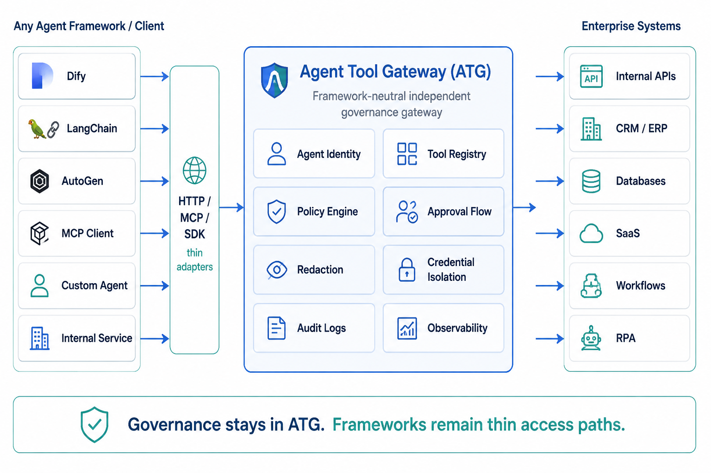
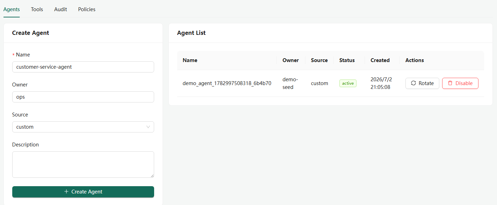
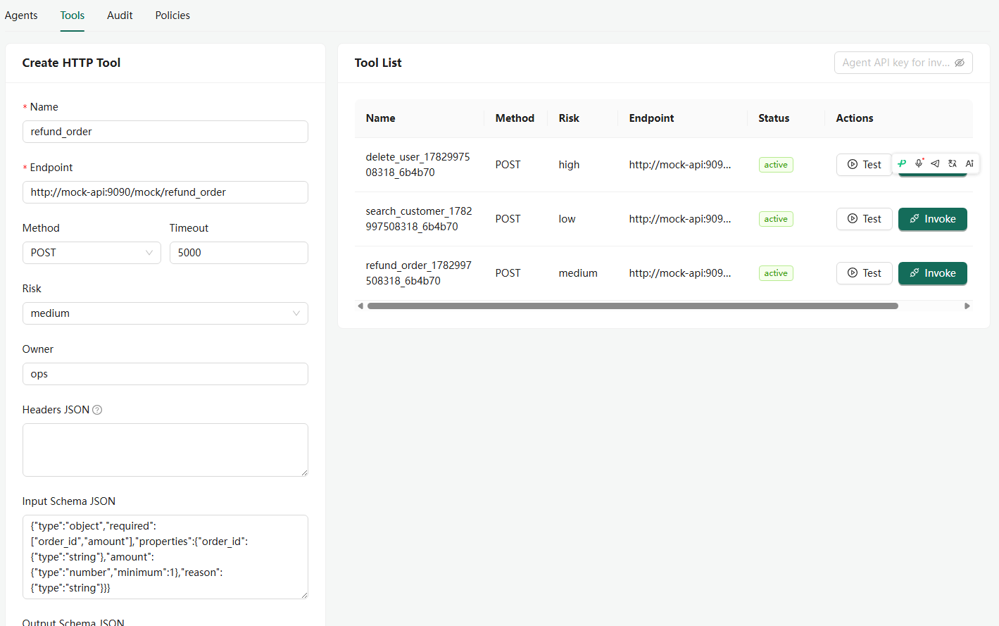
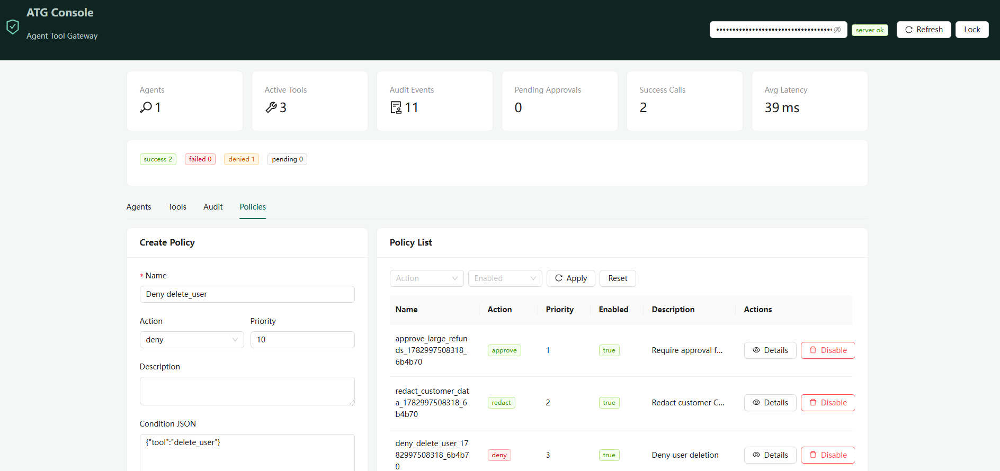
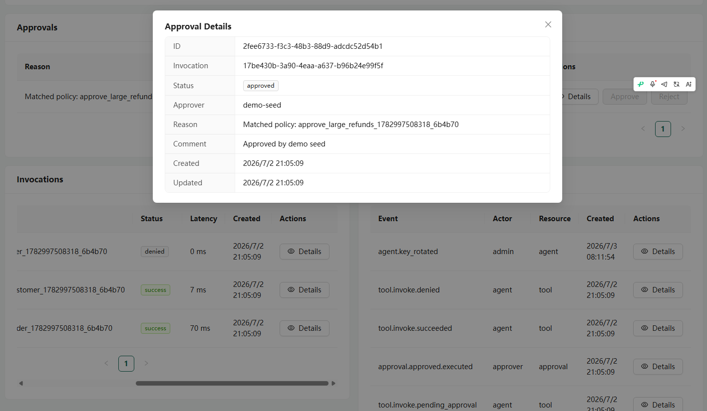
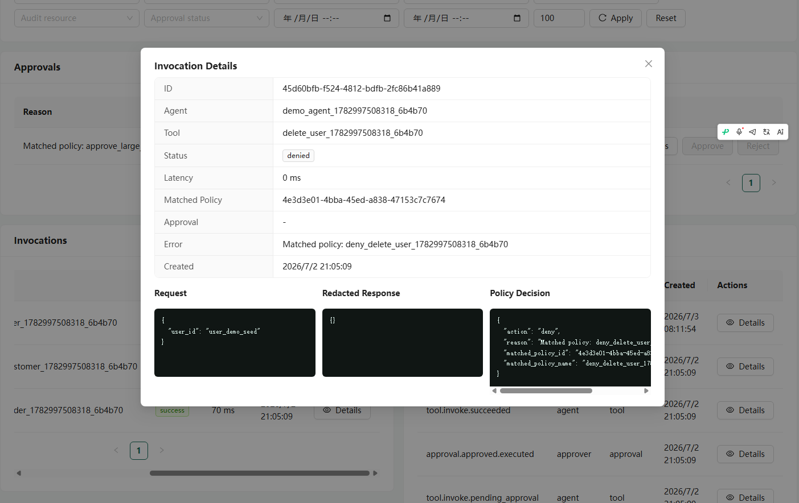
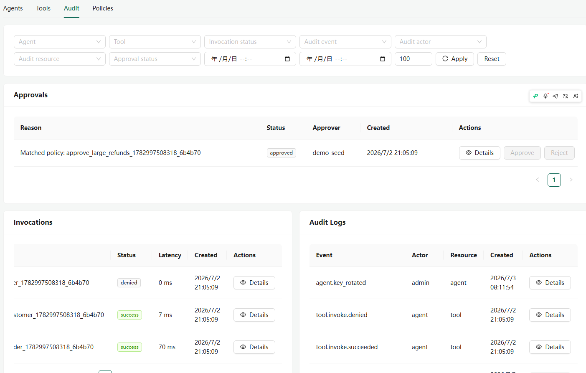

# Agent Tool Gateway

Agent Tool Gateway (ATG) is an open-source gateway that lets AI Agents safely call enterprise HTTP APIs through one governed control path.

ATG sits between Dify, LangChain, MCP clients, SDKs, custom Agents, and your business APIs. It adds Agent credentials, Tool registry, policy decisions, approval, redaction, credential isolation, and audit logs before Agents touch real systems.

This repository is at the `v0.1.0` public MVP stage. It is ready for developer preview, demos, integrator PoCs, and early open-source adoption. It is not an enterprise production release with SSO/RBAC, multi-tenancy, HA, SIEM, or Vault/KMS integrations.



## Product Screenshots

### Agent Registry

Create Agents, rotate Agent API keys, disable unsafe Agents, and keep business API credentials out of Agent runtimes.



### Tool Registry

Register HTTP Tools, configure endpoints, risk levels, headers, and schemas, then test Tool calls through ATG.



### Policy Management

Define allow, deny, approve, and redact policies so high-risk Agent actions are governed before they reach business APIs.



### Approval Review

Review approval-required calls, inspect request context, and approve or reject execution from the Web Console.



### Invocation Evidence

Inspect each Tool invocation, including request arguments, policy decisions, status, latency, and redacted responses.



### Audit Logs

Track governance events across Agent calls, denied operations, approvals, and execution results.



## What You Can Demo

The fastest demo creates one Agent, three Tools, and three policies:

- Refund approval: large refunds require approval before execution.
- CRM redaction: sensitive customer data is masked before return and audit storage.
- Dangerous operation denial: delete-style calls are blocked before reaching the target API.

## Services

- `server/`: Express API, PostgreSQL migration, Agent/Tool/Policy/Approval/Audit endpoints.
- `web/`: React + Ant Design Web Console.
- `examples/mock-api/`: demo HTTP API used by the MVP flows.
- `sdk/python/`: Python SDK and optional LangChain adapter.
- `sdk/typescript/`: TypeScript-friendly SDK.
- `examples/dify/`: Dify HTTP Tool example.
- `examples/mcp-client/`: MCP client example.
- `openapi/atg-openapi.yaml`: OpenAPI spec for the ATG HTTP API.

## Docker Deployment

Set the required secrets first, then start the stack:

```bash
export SECRET_KEY=replace-with-a-long-random-secret-key
export ADMIN_TOKEN=replace-with-a-long-random-admin-token
docker compose up --build
```

Default endpoints:

- ATG API: `http://localhost:8080`
- Web Console: `http://localhost:5173`

Publish the Web Console on a different host port:

```bash
WEB_PORT=80 docker compose up --build
```

The Web Console uses the same `ADMIN_TOKEN` through the `x-admin-token` header.

For production-like single-server evaluation, read the [Deployment Guide](./docs/deployment.md) before sharing the environment.

Required deployment variables:

| Variable | Purpose |
|---|---|
| `DATABASE_URL` | PostgreSQL connection string. Docker Compose sets this for the bundled PostgreSQL service. |
| `SECRET_KEY` | Encrypts sensitive Tool headers before storage. Use a long random value. |
| `ADMIN_TOKEN` | Protects management APIs and the Web Console. |

## Deployment Check

After deploying ATG to a server, run the deployment check from your workstation:

```bash
ATG_BASE_URL=http://<server>:8080 \
MOCK_TOOL_ENDPOINT=http://<mock-api>/mock/refund_order \
ADMIN_TOKEN=<admin-token> \
npm run deployment:check
```

The check verifies health, the admin token gate, Agent/Tool/Policy creation, the approval execution path, persisted Invocation/Approval/Audit detail reads, and the Evidence Export package hashes.

The check writes temporary Agent, Tool, Policy, Invocation, Approval, and Audit records to the target environment. Run it against a fresh evaluation database when you do not want test records in a shared environment.

## Local Development

Copy the environment file and install dependencies:

```bash
cp .env.example .env
npm run install:local
npm run doctor:local
npm run dev:local
```

PowerShell:

```powershell
Copy-Item .env.example .env
npm run install:local
npm run doctor:local
npm run dev:local
```

`dev:local` starts ATG Server, Mock API, and Web Console on the host after running the database migration.

Default local endpoints:

- ATG API: `http://localhost:8080`
- Mock API: `http://localhost:9090`
- Web Console: `http://localhost:5173`

## Run The Fast Demo

Local runtime:

```bash
npm run seed:demo:local
```

Docker/server runtime:

```bash
ATG_BASE_URL=http://<server>:8080 \
MOCK_BASE_URL=http://mock-api:9090 \
ADMIN_TOKEN=<admin-token> \
node scripts/seed-demo-data.mjs
```

PowerShell:

```powershell
$env:ATG_BASE_URL = "http://<server>:8080"
$env:MOCK_BASE_URL = "http://mock-api:9090"
$env:ADMIN_TOKEN = "<admin-token>"
node scripts/seed-demo-data.mjs
```

After the seed completes, open the Web Console and review Agents, Tools, Policies, Approvals, Invocations, and Audit Logs.

## Useful Commands

```bash
npm run check
npm --prefix server test
npm run build
npm run deployment:check:local
npm run smoke:local
npm run demo:local
npm run policy-preview:local
npm run dify:local
npm run mcp-client:local
npm run python-sdk:local
npm run langchain:local
npm run typescript-sdk:local
```

## Integrations

- REST invoke: `POST /api/v1/invoke/{tool_name}` with an Agent API key.
  - `200`: Tool executed successfully.
  - `202`: Tool call is pending approval.
  - `403`: Tool call was denied by policy.
  - `502`: Upstream Tool execution failed.
- MCP: `POST /mcp` supports `initialize`, `tools/list`, and `tools/call`.
- Dify: configure an HTTP Tool to call ATG instead of the business API directly.
- Python: use `sdk/python` for REST, MCP, admin helpers, and LangChain wrapping.
- TypeScript: use `sdk/typescript` for REST, MCP, admin helpers, and typed examples.

## More Languages

- [简体中文](./docs/README.zh-CN.md)
- [Deployment Guide](./docs/deployment.md)
- [Roadmap](./docs/roadmap.md)

## MVP Limits

- Admin authentication is a shared token, not SSO/RBAC.
- MCP support is intentionally limited to the MVP tool loop.
- Approval callbacks/webhooks are out of scope for v0.1.0.
- Multi-tenancy, HA, SIEM, Vault/KMS, and enterprise IAM are future or commercial-edition concerns.

## License

ATG uses a dual-license model:

- Core public edition (`server/`, `web/`, and the gateway code): [GNU Affero General Public License v3.0 only](./LICENSE) (`AGPL-3.0-only`).
- SDKs and examples: MIT-licensed to keep integrations easy to adopt; see `sdk/python/LICENSE`, `sdk/typescript/LICENSE`, and `examples/LICENSE`.
- Commercial licensing: available for proprietary embedding, closed-source modified SaaS/managed-service use, OEM redistribution, enterprise features, private deployment, and support. See [COMMERCIAL.md](./COMMERCIAL.md).

External contributions are accepted under the contributor terms in [CLA.md](./CLA.md), so the project can maintain both the public AGPL edition and commercial licensing path.

Project names, logos, screenshots, and branding are covered by [TRADEMARKS.md](./TRADEMARKS.md).
